# OhOhOps:

OhOhOps is an autonomous SRE control plane for incident detection, code context retrieval, patch generation, security arbitration, isolated execution, and controlled recovery. It provides a FastAPI backend, a six node LangGraph repair cycle, a Next.js Sunfire dashboard, ChromaDB local retrieval, Pinecone cloud retrieval, optional Supabase PostgreSQL audit storage, and RAGAS evaluation support.

The project is created and maintained by Mridankan Mandal through [RedZapdos123](https://github.com/RedZapdos123) and [WhiteMetagross](https://github.com/WhiteMetagross).

## Purpose:

OhOhOps reduces the manual effort required to investigate a production incident while preserving explicit safety boundaries. The agent first evaluates evidence, retrieves relevant code context, proposes a complete replacement patch, requests two model security votes, runs the patch inside a network isolated Docker sandbox, and deploys only after the configured checks pass. A failed deployment restores the prior file through a transactional rollback.

## Capability summary:

1. Six node cyclic LangGraph repair workflow.
2. PyOD Isolation Forest anomaly detection over a configurable telemetry window.
3. Tree Sitter AST aware chunking for Python, JavaScript, TypeScript, TSX, C, C++, and Go.
4. ChromaDB local retrieval and Pinecone cloud retrieval with namespace isolation.
5. A fixed 3072 value embedding contract independent of the configured provider dimension.
6. Dual model security arbitration with unanimous clearance before sandbox execution.
7. Network isolated Docker sandbox execution with memory, CPU, timeout, and retry limits.
8. Transactional patch deployment with backup, health verification, rollback, and retry routing.
9. FastAPI REST endpoints and Server Sent Events for live repair progress.
10. Supabase PostgreSQL operational ledger with explicit row level security and public grant revocation.
11. Next.js dashboard with Sunfire light and dark themes, responsive layouts, tenant key onboarding, telemetry, graph trace, RAG queries, and audit history.

## Visual gallery:

The following captures were taken from the running local Docker stack. The captures show the six stage repair trace, a simulated telemetry anomaly, both Sunfire themes, onboarding, local deployment guidance, and settings. Dashboard captures are focused viewport images so that each feature remains legible.

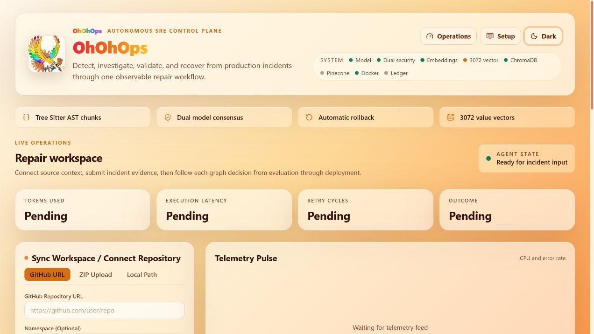

*Figure 1. DashboardLightMode shows the primary operations workspace in the light Sunfire theme.*

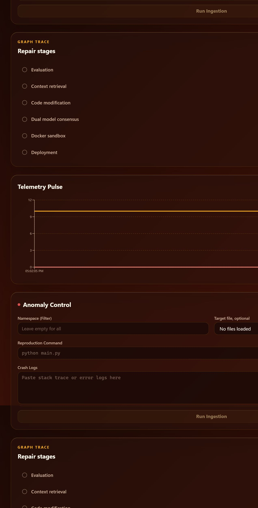

*Figure 2. DashboardDarkMode shows the authenticated dashboard in the dark Sunfire theme.*

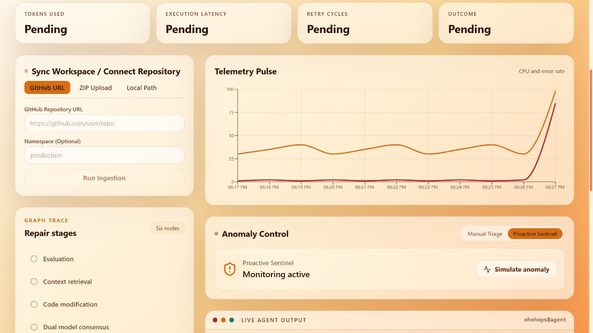

*Figure 3. DashboardTelemetryPulse shows live chart rendering with non-linear telemetry and an explicit anomaly spike generated by the Proactive Sentinel control.*

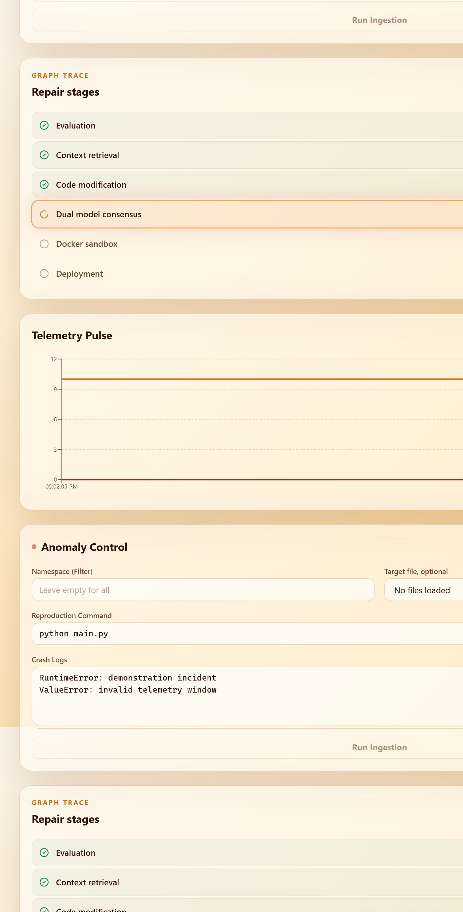

*Figure 4. DashboardRepairWorkflowWorking shows the repair workspace immediately after an anomaly simulation, including the graph trace, monitoring control, telemetry panel, and live output surface.*

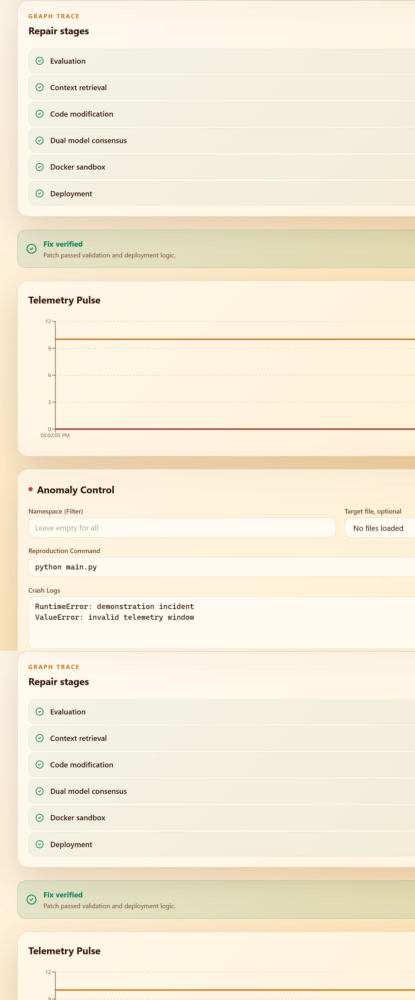

*Figure 5. DashboardRepairWorkflowComplete shows the completed six stage trace in a focused viewport.*


*Figure 6. OnboardingLightMode shows the light theme setup experience in a correctly rendered desktop viewport.*

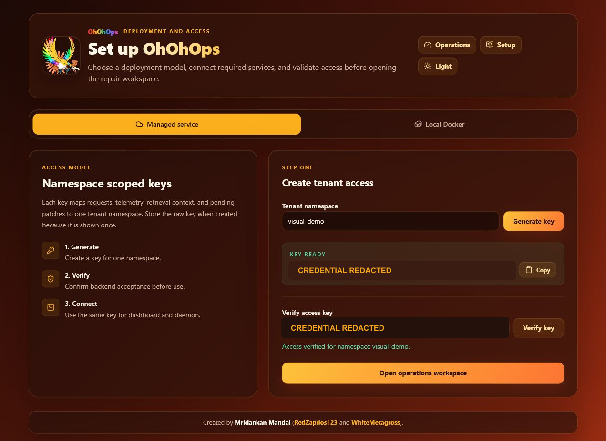

*Figure 7. OnboardingAccessVerifiedRedacted shows successful namespace verification before opening operations, with the credential value redacted.*

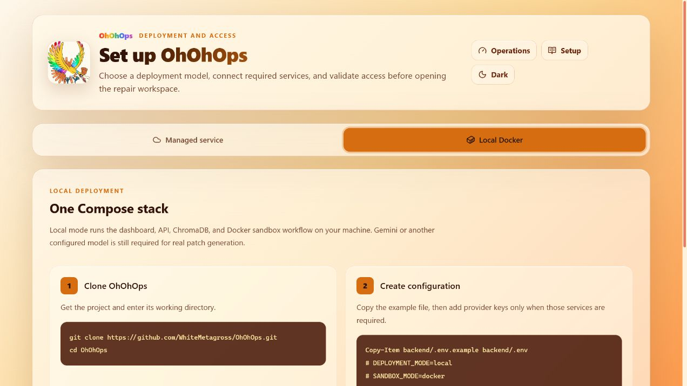

*Figure 8. OnboardingLocalDockerLightMode shows local Compose deployment guidance in a correctly rendered desktop viewport.*

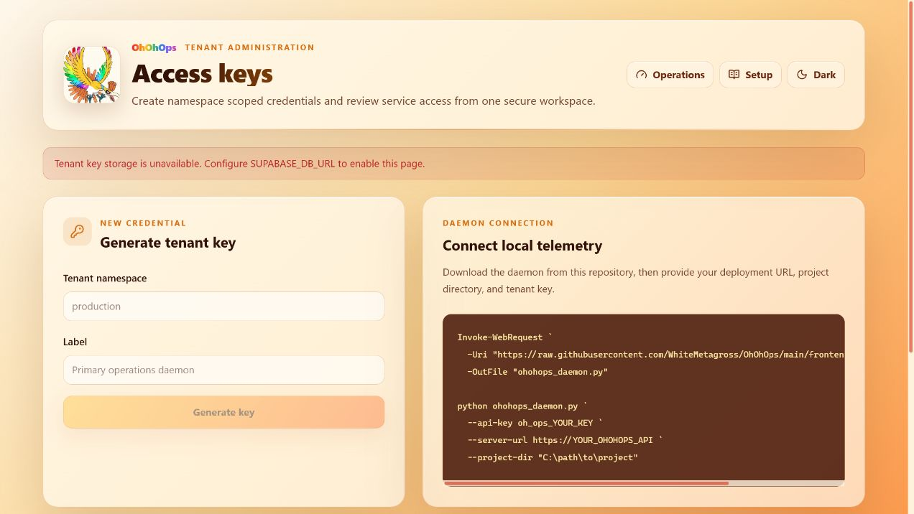

*Figure 9. SettingsLightMode shows tenant key administration and daemon connection guidance in a correctly rendered desktop viewport.*

## Architecture diagrams:

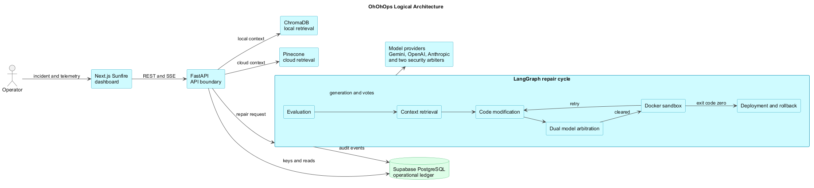

*Figure 10. ArchitectureUml describes the application layers and external provider boundaries. The PNG was compiled from temporary PlantUML source with the local PlantUML engine.*


*Figure 11. DeploymentUml describes the local containers, volumes, sandbox boundary, and cloud services. The PNG was compiled from temporary PlantUML source with the local PlantUML engine.*

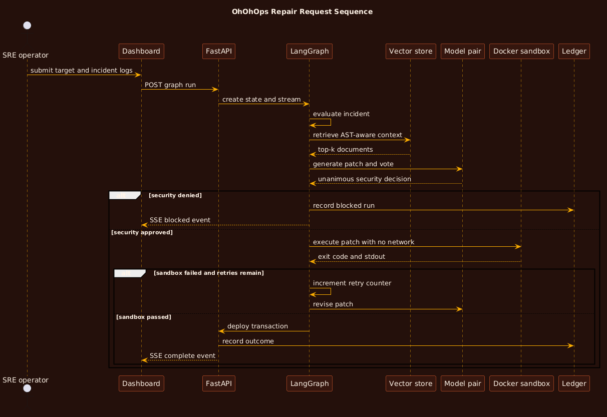

*Figure 12. SequenceUml describes a repair request from dashboard submission through ledger recording. The PNG was compiled from temporary PlantUML source with the local PlantUML engine.*

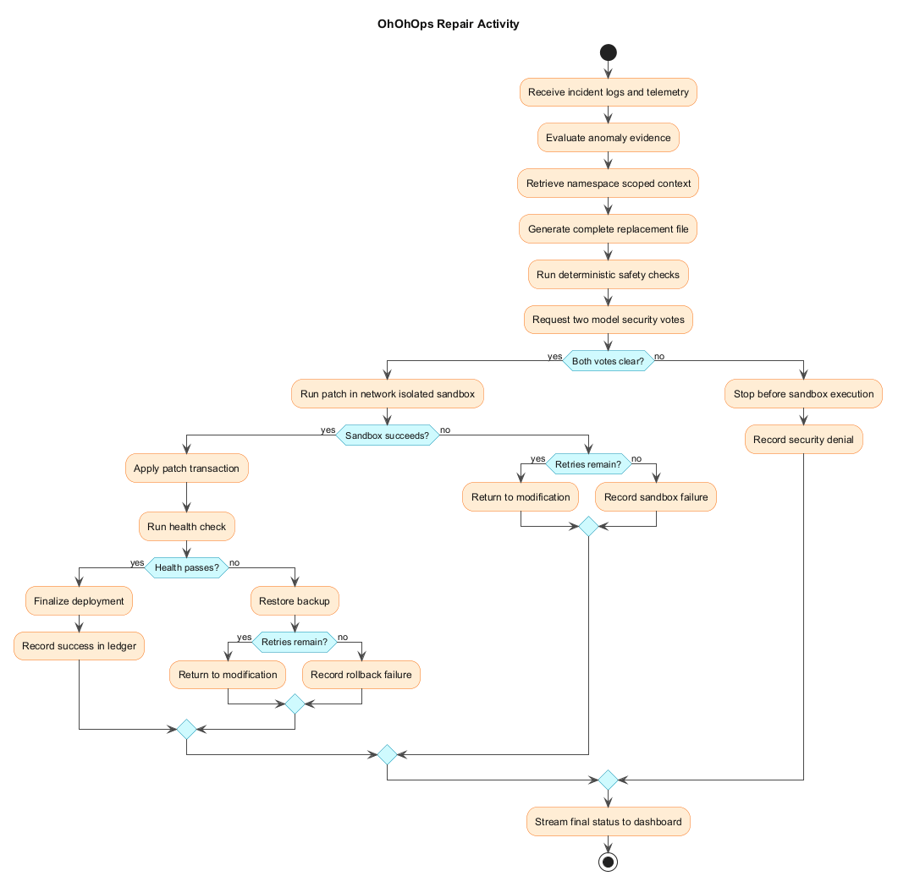

*Figure 13. ActivityUml describes detection, arbitration, sandbox execution, deployment, rollback, and retry decisions. The PNG was compiled from temporary PlantUML source with the local PlantUML engine.*

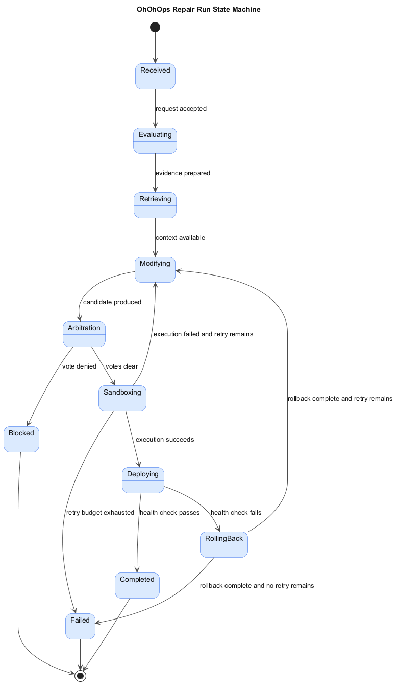

*Figure 14. StateMachineUml describes the durable conceptual states of a repair run. The PNG was compiled from temporary PlantUML source with the local PlantUML engine.*

## Repository map:

1. `backend/app` contains the FastAPI service, graph nodes, providers, security controls, storage services, and schemas.
2. `backend/tests` contains unit and integration oriented backend tests.
3. `backend/scripts` contains live node, sandbox, vector store, and full stack smoke checks.
4. `frontend/src` contains the Next.js App Router pages, dashboard components, clients, and theme system.
5. `frontend/e2e` contains desktop, mobile, navigation, health, and theme persistence tests.
6. `docs` contains architecture, use cases, system design, testing, installation, usage, code index, and agent documentation.
7. `docs/diagrams` contains compiled PlantUML PNG diagrams only. PlantUML source is intentionally not committed.
8. `visuals` contains descriptive ThisCase PNG captures of the running website.

## Quick start:

Requirements are Docker Desktop and Git. Copy `.env.example` to `.env`, keep mock mode enabled for an offline demonstration, and start the stack.

```powershell
Copy-Item .env.example .env
docker compose up --build -d
```

Open `http://localhost:3000`. The local demonstration uses deterministic mock inference, ChromaDB, Docker sandbox execution, and the development API key. Configure real model, Pinecone, and Supabase values only when the corresponding live features are needed.

## Verification:

The complete setup and validation instructions are in the following documents.

1. [Architecture](docs/Architecture.md).
2. [Use cases](docs/UseCase.md).
3. [System design](docs/SystemDesign.md).
4. [Testing](docs/Testing.md).
5. [Installation and setup](docs/InstallationAndSetup.md).
6. [Usage](docs/Usage.md).
7. [Codebase index](docs/CodeBaseIndex.md).
8. [AI agents](docs/AIAgents.md).
9. [Configuration](docs/Configuration.md).
10. [Security policy](SECURITY.md).

## Safety notice:

OhOhOps can control Docker and apply generated patches. Protect the Docker socket, scope provider credentials, use network isolated sandbox mode for production, keep automatic deployment disabled until health checks match the target service, and never commit `.env` or provider credentials.

## License:

MIT. Copyright 2026 Mridankan Mandal.
