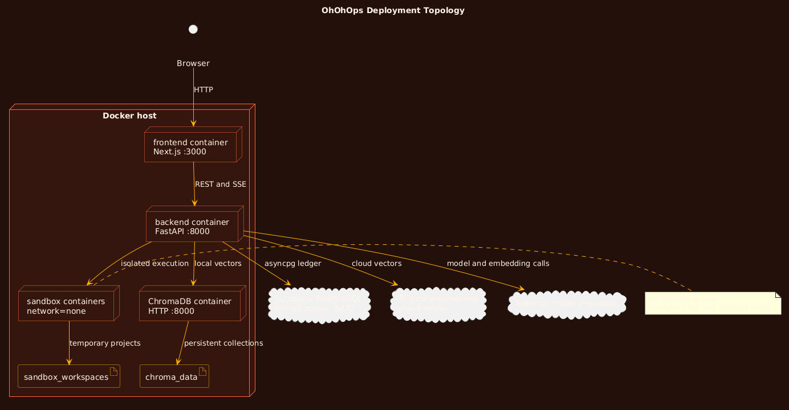

# System Design:

OhOhOps is a containerized service with a browser client, a typed API, a cyclic agent graph, provider adapters, and isolated execution services. The design favors explicit interfaces and observable transitions over hidden background behavior.

*Figure 1. DeploymentUml shows the Compose services, persistent volumes, sandbox boundary, and optional cloud services.*

## Design principles:

1. Keep control flow in the graph and keep provider details in services.
2. Make state transitions explicit in typed schemas.
3. Keep external calls optional where a safe local substitute exists.
4. Prefer idempotent initialization and bounded retries.
5. Treat credentials, tenant namespaces, source code, and patch output as sensitive data.
6. Make the dashboard a view of backend state rather than a second orchestration engine.

## Component model:

### Frontend:

The frontend uses Next.js App Router and React client components for the interactive dashboard. `BrandHeader` owns navigation and attribution. `HealthStrip` renders dependency status. `NodeStatusPanel` renders the six graph stages. `RunForm` and `IncidentPanel` collect repair input and display active output. `TelemetryChart` renders CPU and error rate. `ContextPanel` provides RAG questions. `LedgerHistory` renders recent audit rows. `ThemeToggle` persists the Sunfire theme.

The frontend clients attach a bearer key to protected API calls. SSE parsing is centralized in `sseClient` and `useGraphStream`. Typed dashboard interfaces keep component rendering independent from raw response shapes.

### FastAPI application:

The application entry point registers the versioned API router and lifespan. Lifespan creates the cached settings object, a Pinecone client when possible, the ledger pool, the patch store, the Docker client, and the optional telemetry task. Shutdown closes the telemetry task, ledger pool, and Docker client.

The route groups have the following responsibilities.

1. `health` reports status and dependencies.
2. `system` reports operating mode.
3. `ingest` accepts repositories, archives, and local paths.
4. `context` streams retrieval grounded answers.
5. `graph` runs and streams repair graphs.
6. `anomaly` exposes simulation and anomaly control.
7. `telemetry` accepts daemon metrics and optionally queues repairs.
8. `deployments` acknowledges or lists pending deployment records.
9. `keys` creates, verifies, lists, and revokes tenant keys.
10. `ledger` returns recent operational events.

### Agent graph:

The graph state is an `AgentState` dictionary containing incident evidence, target information, context, proposed patch, security results, retry count, execution result, deployment result, and token accounting. The graph compiler defines the fixed forward path and conditional retry edges. The graph is intentionally small enough to inspect while still supporting a complete repair loop.

## API contracts:

### Health response:

The health endpoint returns a top level status and a dependencies object. Dependency values include model, security arbiters, embeddings, embedding dimension, Pinecone, ChromaDB, Docker, and ledger. The embedding dimension is rendered as a string to match the existing frontend health type.

### Graph stream:

The graph endpoint returns an SSE stream. Events identify node updates, system output, patch output, security decisions, sandbox output, deployment output, complete state, and errors. The frontend treats `complete` as terminal and renders the latest state metrics.

### Ledger record:

An operational record contains an identifier, timestamp, event source, action, execution payload, status, token consumption, compute latency, and optional RAGAS fidelity score. The API returns the newest records first and degrades to an empty result when the ledger is unavailable.

### Tenant key:

The backend returns a raw `oh_ops_` key only at creation time. The stored `key_hash` is a 64 character digest. Requests use the hash to recover the namespace and attach it to downstream operations.

## Storage design:

### Vector storage:

The local Chroma collection name is composed from a configured prefix and sanitized namespace. The cloud Pinecone index is `ohohops-3072` with cosine similarity and serverless configuration. The service batches document upserts and applies provider specific pacing.

### Ledger storage:

`operational_logs` stores audit events. `api_keys` stores tenant credential hashes and revocation state. `pending_deployments` stores patches waiting for daemon acknowledgement. Schema creation is idempotent, row level security is explicit, and public Supabase roles are denied table access.

### Workspaces:

Docker Compose mounts a named sandbox workspace volume. Each graph run uses a namespace and project path. The sandbox process receives only the files required for execution, and network mode is `none` in Docker mode.

## Configuration design:

The Pydantic Settings object loads `.env`, ignores unknown variables, normalizes optional credentials, and validates mode requirements. Cloud mode requires a Pinecone key. Local mode requires a Chroma host. Provider selection is deterministic based on mock mode, local embeddings, OpenAI, or Gemini configuration.

## Concurrency and limits:

1. The ledger pool uses one to five connections and disables statement caching for Supavisor compatibility.
2. The graph uses a configured maximum retry count.
3. The sandbox applies memory, CPU, and timeout limits.
4. Telemetry background execution is opt in.
5. The frontend browser tests use two workers for stable local and CI execution.
6. Retrieval uses a bounded top-k value.

## Observability:

Application logs identify provider initialization, graph transitions, retry decisions, sandbox results, deployment results, and ledger failures. The dashboard exposes health, node trace, latency, retry count, telemetry, live agent output, and ledger events. RAGAS can score faithfulness and context recall and persist the score in the ledger when configured.

## Threat model:

The design assumes provider keys, database credentials, source repositories, and generated patches can cause material impact. The main controls are environment-only secrets, tenant key hashing, route authentication, namespace filtering, archive containment checks, AST chunking, model arbitration, deterministic command scanning, network isolation, transactional writes, rollback, and database row level security.
